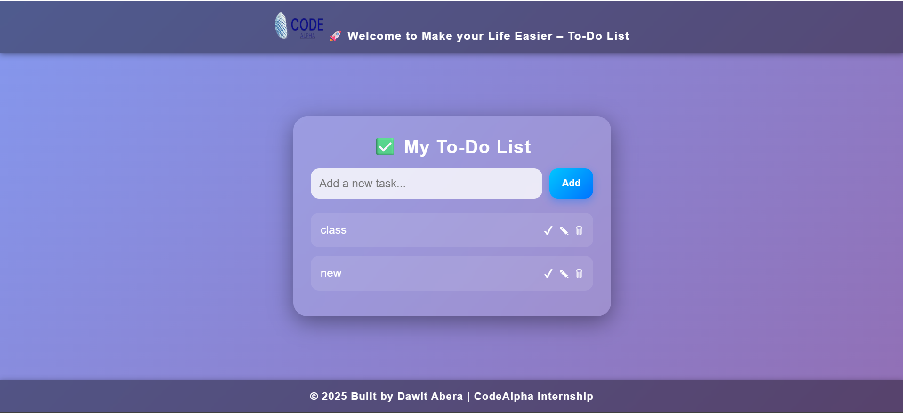

# CodeAlpha_Tasks
🚀 Welcome to CodeAlpha To-Do List – A simple and elegant To-Do List application designed to make your life easier!

This web app allows you to create, edit, mark as complete, and delete tasks, all with a visually appealing design.

                              Features

Add Tasks: Quickly add new tasks using the input field.

Mark Tasks as Complete: Easily mark tasks as completed by clicking the "✔" button.

Edit Tasks: Modify any task by clicking the "✎" button and updating it.

Delete Tasks: Remove tasks from the list with a click of the "🗑" button.

Persistent Storage: Tasks are saved in localStorage so that they persist even when the page is reloaded.

Stylish Design: With a clean, modern UI featuring a gradient background and smooth animations.

                     Screenshots

 

                   Installation

To get started with this project, you need to have basic knowledge of HTML, CSS, and JavaScript. No server-side installation is required.

1.Clone the repository:

git clone https://github.com/YourUsername/CodeAlpha_ToDoList.git

2.Navigate to the project directory:

cd CodeAlpha_ToDoList

Open the index.html file in your browser.

                                       How It Works
                                       

Adding Tasks: You can add a new task by typing it in the input field and clicking the "Add" button or by pressing the "Enter" key.

Marking as Complete: Clicking the "✔" button will mark a task as completed, which strikes it through and dims the text.

Editing Tasks: Clicking the "✎" button allows you to edit a task's text.

Deleting Tasks: Clicking the "🗑" button removes the task from the list entirely.

The tasks are stored in localStorage to ensure they persist across page reloads.

                                  Technologies Used

HTML5: Structure and content of the web page.

CSS3: Styles for the UI, including gradient backgrounds, animations, and responsiveness.

JavaScript: Functionality for adding, editing, completing, and deleting tasks. Uses localStorage for persistent data storage.

                                 Features

Task Management: Add, mark complete, edit, and delete tasks.

Persistent Data: Your tasks are saved in the browser's local storage, ensuring they persist even if you refresh the page.

Responsive UI: Works well on different screen sizes (mobile, tablet, desktop).

Animations: Tasks appear with a smooth fade-in effect and interactive buttons.

                               Contributing

We welcome contributions to improve this project! To get started:

Fork the repository.

Create a new branch (git checkout -b feature/your-feature).

Make your changes.

Commit your changes (git commit -am 'Add new feature').

Push to your branch (git push origin feature/your-feature).

Create a pull request.

                        License

This project is licensed under the MIT License – see the LICENSE
 file for details.

                        Credits

Author: Dawit Abera

Project: CodeAlpha Internship